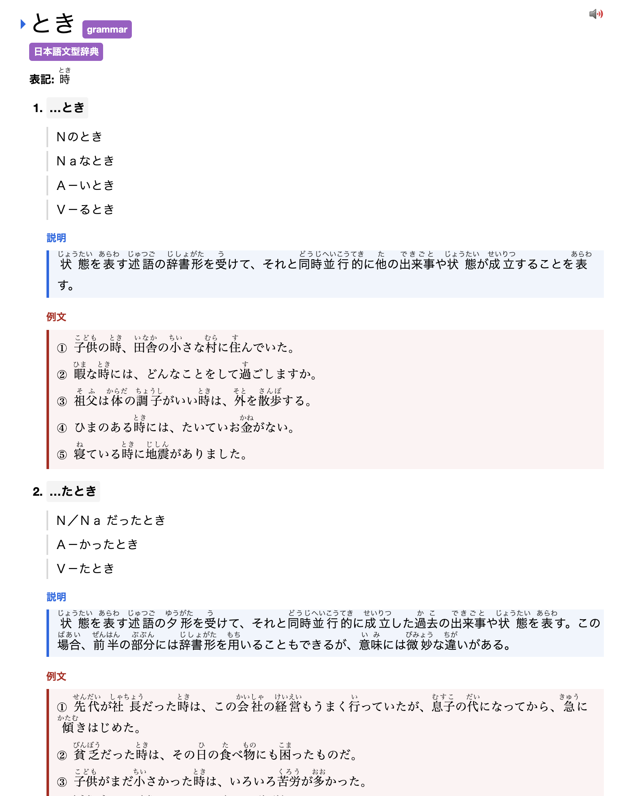
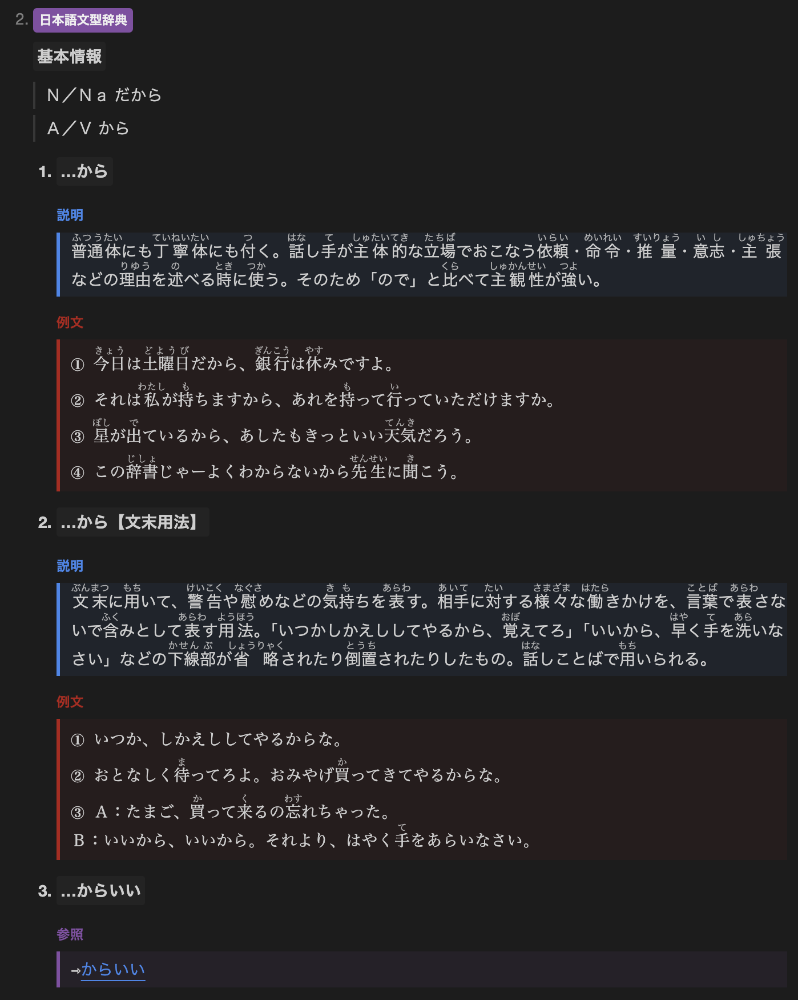

# Japanese Bunkei Dictionary for Yomitan

A rebuild of the Japanese grammar dictionary from mefat.review as a standard Yomitan dictionary.

## Screenshots





## Build

Requirements:

- Python 3

Generate the dictionary locally:

```bash
python3 build_standard_yomitan_dict.py
```

By default, this writes:

```text
Nihongo-Bunkei-Jiten.zip
```

You can also set a custom output path and dictionary title:

```bash
python3 build_standard_yomitan_dict.py \
  --output custom-bunkei-dictionary.zip \
  --name "Japanese Bunkei Dictionary"
```

## Source Data

Thanks to the original source:

- [mefat.review bunkei.ziten](https://www.mefat.review/bunkei.ziten.html)

The raw files used to build this dictionary are cached in `raw/mefat.review/`.
